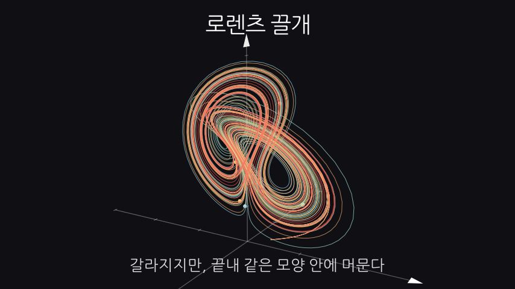
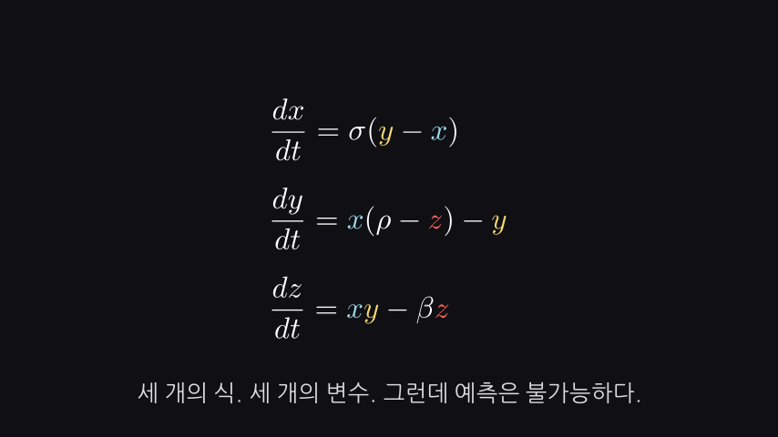
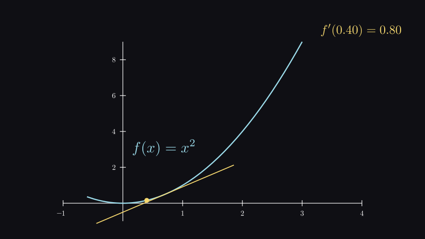
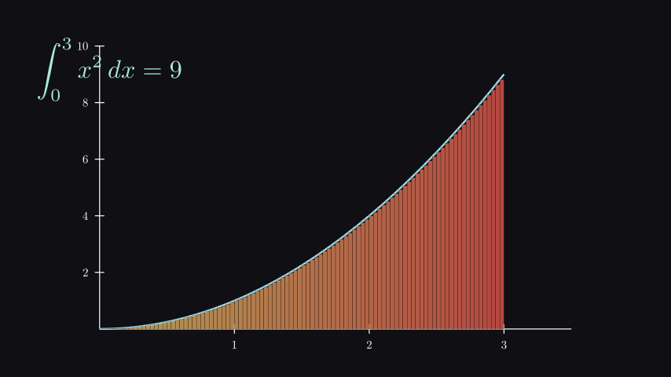
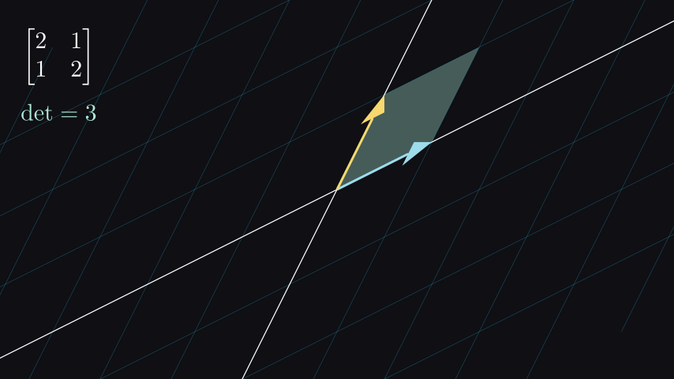
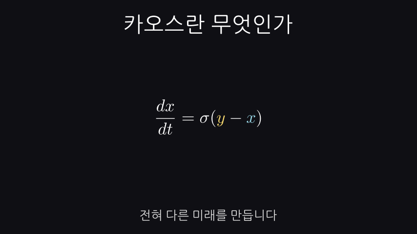
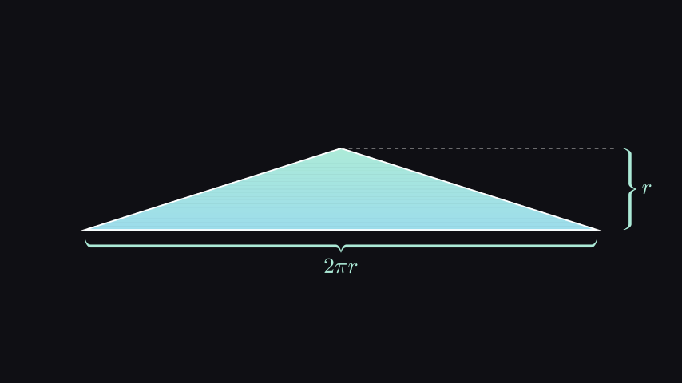
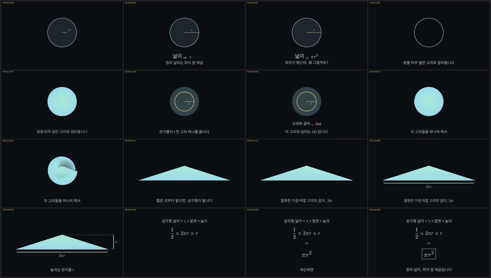
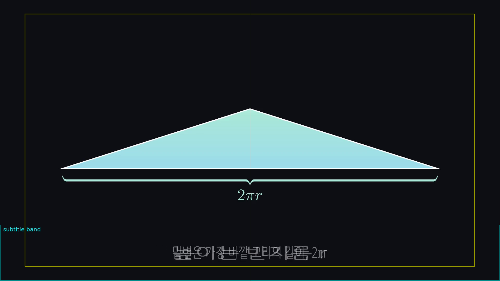

# math-video-agent

Manim으로 **3Blue1Brown 스타일 수학 애니메이션 영상**을 만드는
Claude Code 플러그인.

주제 한 줄을 주면 → 콘티(같이 짠다) → 씬 코드 → 프리뷰 검증 →
최종 렌더 → 완성본 검수까지 간다.

방법론의 출처는 3Blue1Brown(Grant Sanderson)이 자신의 실제 제작
과정을 공개한 영상
[*How I animate 3Blue1Brown — A Manim demo with Ben Sparks*](https://www.youtube.com/watch?v=rbu7Zu5X1zI)
다. 영상에서 관찰된 워크플로우를 스킬·에이전트·템플릿으로 옮긴
매핑표는 [`docs/source-video-analysis.md`](docs/source-video-analysis.md)에 있다.

아래 그림은 전부 이 레포의 템플릿을 **실제로 렌더한 결과**다
(Manim CE v0.21.0, `mv.py still`).

| | |
|---|---|
|  |  |
| `ode_trajectory.py LorenzAttractor` | `ode_trajectory.py LorenzEquations` |
|  |  |
| `graph_plot.py TangentSlope` | `graph_plot.py RiemannSum` |
|  |  |
| `vector_field.py LinearTransform` | `scene_base.py TitleDemo` |

---

## 구성

```
agents/
  math-video-director.md      기획→렌더→검수 전 과정을 몰고 가는 감독
  math-video-qc.md            렌더된 영상을 프레임으로 뜯어보는 검수 담당
commands/
  math-video.md               /math-video  — 주제 → 완성 영상
  storyboard.md               /storyboard  — 콘티만 (사용자와 단계별로)
  mv-render.md                /mv-render   — 기존 씬을 검증 루프에 태워 렌더
  mv-qc.md                    /mv-qc       — 완성된 영상 검수
skills/
  manim-video/                메인 스킬 — 파이프라인·코딩 규칙·프리뷰 루프·검수
    references/               CE 쿡북 / 3b1b 연출 문법 / 검수 체크리스트 /
                              한글 / ManimGL / 트러블슈팅
    templates/                씬 템플릿 6종
    scripts/                  mv.py (렌더·배치검사·이어붙이기), qc.py (검수),
                              setup_manim.sh
assets/sfx/                   효과음 9종 + generate.sh (ffmpeg 합성)
  math-storyboard/            콘티 스킬 — 6단계로 사용자와 함께 기획
docs/
  source-video-analysis.md    원본 영상 분석 + 이 레포로의 매핑
```

---

## 설치

### 1) Manim 환경

```bash
bash skills/manim-video/scripts/setup_manim.sh
python3 skills/manim-video/scripts/mv.py check
```

`check`가 전부 OK가 되어야 한다. LaTeX(수 GB)를 빼려면
`setup_manim.sh --no-tex` — 대신 `MathTex`를 못 쓴다.

### 2) 플러그인 등록

Claude Code에서:

```
/plugin marketplace add juvilan/math-video-agent
/plugin install math-video-agent
```

또는 로컬 프로젝트에 그냥 복사해서 `skills/`, `agents/`,
`commands/`를 쓰는 방식도 된다.

---

## 사용

```
/math-video 행렬식이 왜 넓이 배율인지
/math-video 로렌츠 끌개와 카오스 --길이 7분 --4k
/storyboard 푸리에 변환 --대상 학부1학년
/mv-render scenes/lorenz.py LorenzAttractor --4k
/mv-qc media/videos/circle_area/1080p60/circle-area-full.mp4
```

에이전트를 직접 부르려면:

```
math-video-director 에이전트로 "베이즈 정리" 영상 만들어줘
```

---

## 예제 — 파이프라인을 끝까지 돌린 결과

[`examples/circle-area/`](examples/circle-area/) 에 주제 한 줄에서
1080p60 완본(64.0초)까지 간 전체 기록이 있다. 기획서, 씬 코드,
그리고 **④ 검증에서 3건 + ⑥ 검수에서 4건**의 실제 버그 기록이
그대로 남아 있다.



> 원을 얇은 고리로 자른다 → 반지름 t인 고리의 길이는 2πt →
> 펴서 짧은 것부터 쌓으면 밑변 2πr, 높이 r인 삼각형 → ½ × 2πr × r = πr²

---

## 파이프라인

```
① 기획      주제 → 핵심 한 문장 → 콘티              math-storyboard (사용자와 함께)
② 씬 분할   비트 → Scene (1씬 = 1아이디어 = 20~60초)
③ 코딩      템플릿에서 시작                          manim-video/templates
④ 검증 ★   layout(텍스트) → still(PNG) → preview(mp4)  mv.py
⑤ 최종      1080p60 / 4K60 렌더                      mv.py final
⑥ 검수 ★   완성본을 프레임으로 뜯어본다              qc.py + math-video-qc
```

①은 **혼자 만들지 않는다.** 핵심 한 문장 / 대상·길이 / 비트 뼈대 /
콘티 / 내레이션 다섯 지점에서 멈추고 확인받는다. 완성된 기획안을
통째로 들이밀면 사용자는 고칠 데를 못 찾는다.

### ④가 핵심이다

원본 영상에서 Grant가 쓰는 `checkpoint_paste` — 씬 상태를 캐싱해
짧은 구간만 반복 확인하는 Sublime 매크로 — 가 제작 속도를
좌우한다. Claude Code에는 그 매크로가 없으므로 세 가지로 재구성했다:

1. 씬을 20~60초로 **강제 분할**
2. `mv.py still ... -n 3,5` 로 특정 구간의 마지막 프레임만 PNG 렌더
3. 그 PNG를 **Read 툴로 열어서 실제로 본다**

Manim 코드는 문법이 통과해도 조용히 망가진다 — 객체가 화면 밖에
있거나, 라벨이 겹치거나, 한글이 네모로 나오거나, 3D 카메라가
물체 뒤를 보고 있어도 에러가 없다. **렌더한 그림을 보지 않은 씬은
완성된 게 아니다.**

### 토큰은 이미지에서 나간다

이 파이프라인에서 압도적으로 비싼 동작은 **렌더된 이미지를 Read
하는 것**이다. 그래서 ④를 두 겹으로 나눴다.

```bash
python3 skills/manim-video/scripts/mv.py layout scenes/circle.py Unroll
```

```
배치 문제 1종:
  [play#19~play#21] MathTex('r') title-safe 밖 (x 6.28~6.47, 안전 ±6.40)
```

씬을 끝까지 돌리되 **이미지를 만들지 않고** 매 `play` 마다 좌표로
검사한다 — 화면 밖 / title-safe 이탈 / 글자 겹침 / 효과음 파일 없음.
반복해도 싸다. 이게 깨끗해진 뒤에 스틸을 본다.

| | `layout` (텍스트) | `still` (이미지) |
|---|---|---|
| 화면 밖 / 겹침 / 안전영역 | ✓ | ✓ (비싸게) |
| 색이 배경과 붙는지 | ✗ | ✓ |
| 그림이 의도한 모양인지 | ✗ | ✓ |

그리고 **콘티에서 화면 배치를 미리 정하면** 이 둘 다 덜 돌린다.
`storyboard.md` 템플릿에 배치표가 들어간 이유다. 비용 순서 전체는
`references/token-budget.md`.

실제로 `layout` 은 ④~⑧이 전부 놓쳤던 title-safe 이탈 1건을
이미지 한 장 없이 잡았다.

### ⑥은 ④가 못 보는 걸 본다

④는 **정지 화면 하나의 구도**를, ⑥은 **완성된 영상의 흐름**을 본다.
정지 화면으로는 절대 안 보이는 것들이 있다:

```bash
QC=skills/manim-video/scripts/qc.py
python3 $QC stats  out.mp4            # 검은 화면 / 4초 이상 정지 (자동)
python3 $QC sheet  out.mp4 -g 4x4     # 전체를 16칸 대조표 한 장으로
python3 $QC guides out.mp4 46.0       # title-safe + 자막 밴드 오버레이
python3 $QC strip  out.mp4 17.5 19 -n 6   # 특정 구간 촘촘히
```

| 못 보던 것 | 잡는 법 |
|---|---|
| 자막이 4초 넘게 멈춰 있는 죽은 시간 | `stats` 자동 + `sheet`에서 같은 자막이 두 칸에 걸침 |
| 자막은 "고리로 자릅니다"인데 화면엔 고리가 없음 | `sheet` 한 장 |
| 자막이 title-safe 밖으로 나가 유튜브 UI에 덮임 | `guides` |
| 자막 전환 순간 두 자막이 겹쳐 뭉개짐 | `sheet` / `strip` |
| 변형 애니메이션 중간이 정체불명이 됨 | `strip` |

`sheet` — 64초 영상을 16칸 한 장으로. 자막·화면·색을 한눈에 대조한다.



`guides` — title-safe(노랑)와 자막 밴드(청록)를 덧그려 자막이
잘릴 위치에 있는지 판정한다.



실제로 이 레포의 예제 영상은 ④를 통과한 뒤 ⑥에서 4건이 더 나왔고,
그중 둘은 예제가 아니라 **템플릿 쪽 버그**였다.

---

## 씬 템플릿

| 파일 | 내용 |
|---|---|
| `scene_base.py` | 팔레트·한글 폰트·자막 헬퍼. 모든 씬의 출발점 |
| `ode_trajectory.py` | **로렌츠 끌개** — scipy 수치해, 초기조건 발산, 3D 카메라 회전, 잔상 꼬리 |
| `formula_walkthrough.py` | 수식을 항별로 색칠·강조·해설 |
| `transform_anagram.py` | 수식 A → B, 글자가 자리를 옮기는 변형 |
| `graph_plot.py` | 접선·기울기, 리만합→적분, 파라미터 훑기 |
| `vector_field.py` | 선형변환(행렬식=넓이배율), 벡터장·흐름선 |

`ode_trajectory.py`는 원본 영상의 메인 프로젝트를 CE로 통째로
포팅한 것이다. `lorenz_system`과 축 범위만 바꾸면 Rössler,
이중진자 등에 그대로 쓸 수 있다.

---

## 효과음

`assets/sfx/` 에 음원을 두고:

```python
self.sfx("whoosh", gain=-12)      # play **앞에**
self.play(Create(circle), run_time=1.5)
```

한 씬에 3개까지. 과하면 유치해진다.

**소리는 세 가지 방식으로 조용히 사라진다** — 전부 에러 없이:

1. manim 캐시가 켜져 있으면 `add_sound` 가 아무 일도 안 한다
   (`mv.py` 가 소스에 소리가 있으면 캐시를 자동으로 끈다)
2. 씬 맨 앞에서 소리를 앞당기면 예외가 나는데 렌더는 성공으로 끝난다
   (`sfx()` 가 현재 시각을 보고 잘라낸다)
3. `ffmpeg concat -c copy` 로 이어붙일 때 첫 파일에 오디오가 없으면
   뒤 소리가 전부 버려진다 (`mv.py join` 이 오디오를 정규화한다)

```bash
python3 skills/manim-video/scripts/mv.py join out.mp4 A.mp4 B.mp4 C.mp4
python3 skills/manim-video/scripts/qc.py stats out.mp4   # 오디오 트랙 확인
```

레포에 효과음 9종이 딸려온다 — `pop` `tick` `click` `whoosh` `sweep`
`rise` `drop` `reveal` `chime`. 전부 `assets/sfx/generate.sh` 가
ffmpeg 로 합성한 것이라 **저작권 문제가 없고**, 톤이 안 맞으면
스크립트의 수식만 고쳐 다시 돌리면 된다.

```bash
bash assets/sfx/generate.sh     # 길이·피크·RMS 표까지 찍어준다
```

자세한 건 `references/audio.md`.

---

## 코딩 하드 룰

`skills/manim-video/SKILL.md` §3의 요약:

1. **좌표는 반드시 `axes.c2p()`를 거친다.** 하드코딩하면 축 범위를
   바꾸는 순간 전부 깨진다.
2. **변수 하나 = 색 하나.** 수식·그래프·라벨 어디에 나오든 같은 색.
   동시에 3~4색을 넘기지 않는다.
3. **시간이 흐르는 궤적은 `rate_func=linear`.** 기본값 `smooth`를
   쓰면 끝에서 시간이 느려지는 물리적으로 틀린 그림이 된다.
4. `run_time`은 내레이션 길이에서 역산한다.
5. 씬이 60초를 넘으면 쪼갠다.
6. 점 2000개 초과 시 `set_points_smoothly` 대신 `set_points_as_corners`.
7. 한글은 `Text(font=...)`, 수식은 `MathTex`. `Tex`에 한글을 넣지 않는다.

---

## 한국어 / 영어

기본은 한국어. 자막·라벨은 `Text(font="NanumGothic")`, 수식은
`MathTex`로 분리한다 (`Tex`는 기본 LaTeX 템플릿에서 한글이 깨진다).

영어 버전은 문자열을 `STRINGS` dict에 모아두고:

```bash
MV_LANG=en manim -qh scene.py MyScene
```

자세한 건 `skills/manim-video/references/typography-korean.md`.

---

## Manim CE vs ManimGL

기본은 **Community Edition**. 설치가 쉽고 문서가 있고 헤드리스에서
돈다. 원본 영상의 `embed()` 인터랙티브 워크플로우가 꼭 필요하거나
3b1b 공식 저장소 코드를 그대로 돌려야 할 때만 ManimGL로 간다 —
전환 가이드와 API 차이표는
`skills/manim-video/references/manimgl.md`.

CE 코드는 ManimGL에서 그대로 돌지 않는다. 호환 레이어가 없다.

---

## 경계

이 플러그인은 **Manim 렌더 파일까지** 만든다. 내레이션 녹음, 컷
편집, BGM, 썸네일, 업로드는 범위 밖이다 — Final Cut / Premiere /
DaVinci 쪽 작업이다. 원본 영상에서도 Grant는 렌더된 MP4를
Final Cut으로 가져가서 편집한다.

---

## 검증 상태

씬 템플릿 6개 파일의 **모든 Scene 클래스를 Manim CE v0.21.0에서
실제로 렌더해 통과**시켰다 (Python 3.11, LaTeX = TeX Live,
한글 = NanumGothic). `docs/images/`의 그림이 그 결과물이다.
렌더 스틸을 눈으로 보고 고친 것들:

- `FlowLines` — 장이 0이 되는 점에서 `StreamLines`의 `run_time`이
  음수가 되며 크래시. 0을 지나지 않는 장으로 교체.
- `FormulaWalkthrough` — `\left(` / `\right)` 를 별도 항으로 나누면
  글리프 분배가 어긋남. 평범한 괄호로 교체.
- `TangentSlope`, `RiemannSum` — 라벨이 곡선과 겹침. 위치 이동.
- `LorenzAttractor` — 궤적 8개가 한 덩어리로 뭉개짐. 5개로 축소.
- `TitleDemo` — 마지막에 전부 FadeOut 되어 스틸이 검은 화면.
  스모크 테스트로 쓰이도록 화면을 남김.

`qc.py`도 실제 렌더물에 돌려 임계값을 맞췄다. `blackdetect`의 흔한
기본값은 이 스타일에서 멀쩡한 씬을 통째로 오탐해서 못 쓴다 —
`pic_th=0.995, pix_th=0.07`로 잡아뒀다.

문서(`references/`)의 API 기술은 CE 0.18~0.21 기준이며, 이 중
실제 실행으로 확인된 것은 템플릿이 사용하는 범위다. ManimGL 절은
문서 대조로만 작성했고 실행 검증은 하지 않았다.

---

## 라이선스

MIT. Manim은 별도 라이선스(MIT)를 따르며 이 레포에 포함되지 않는다.
